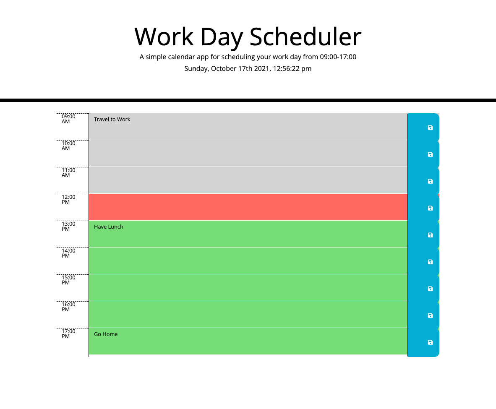

## Work Day Scheduler

- Calendar application that allows the user to save events for each hour of the day.

- This app will run in the browser and feature dynamically updated HTML and CSS powered by jQuery.
- Timeblocks are color coded easily show hours of the day.

- Timeblocks dynamically created using JQuery & Javascript.

- Moment.js library used to work date and time.

## Links

**github** [https://github.com/jj77847/work-day-scheduler/tree/dev]

**website** [https://jj77847.github.io/work-day-scheduler/]

## Screenshot

